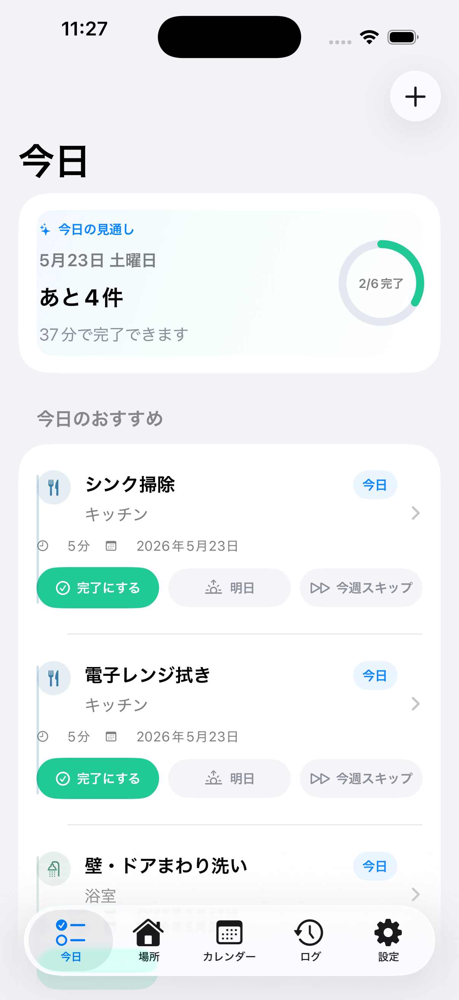
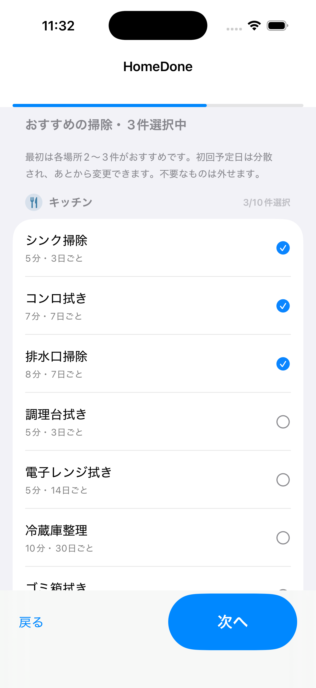
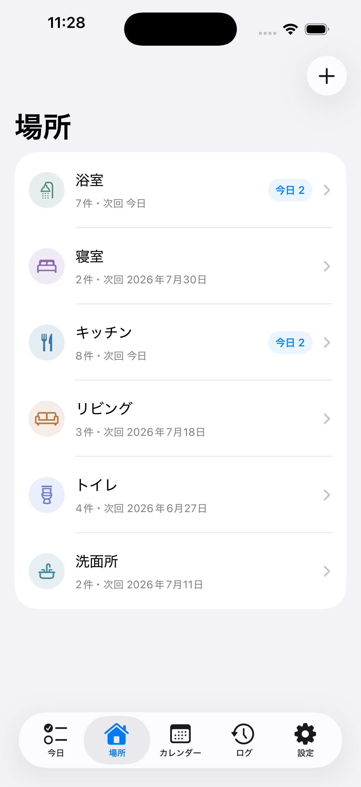
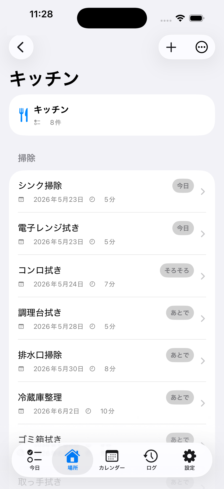
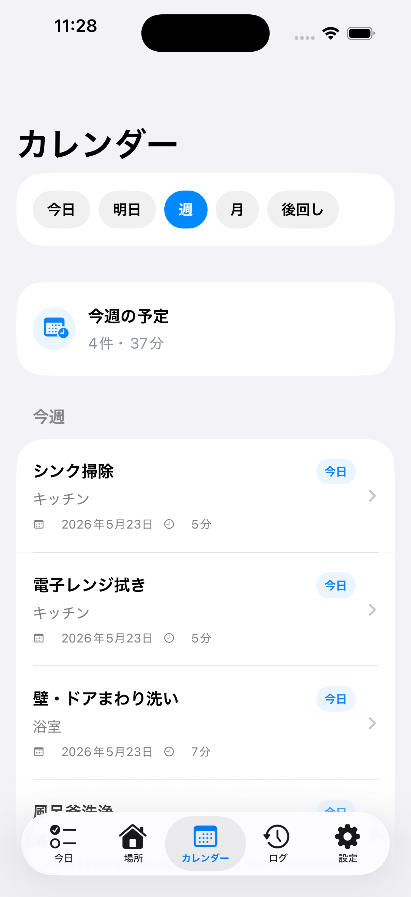
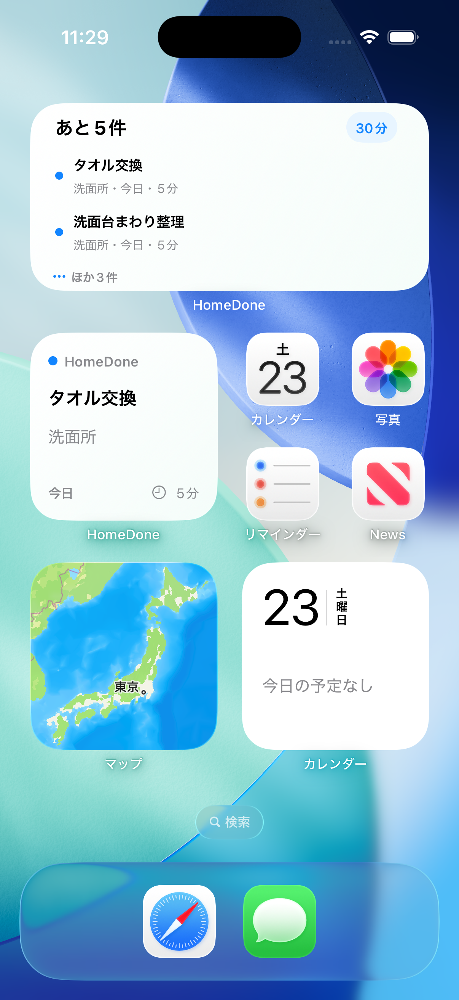

# HomeDone iOS Sample

## 概要

このリポジトリは、SwiftUI / SwiftData で作成した iOS 向けホームタスク管理アプリの公開用サンプルです。

掃除や家事の定期タスク管理、今日やる作業の提案、通知、Widget、StoreKit 2 による Pro 解放フロー、ローカライズ、テストしやすい設計などを示すために構成しています。

商用アプリのコードをそのまま公開するのではなく、主要機能だけを抽出し、確認しやすいサイズに再構成しています。公開用のため、bundle ID、App Group、IAP ID、URL、アイコンなどはサンプル値に置き換えています。

## Demo

| ja_3 | ja_1 | ja_4 |
|---|---|---|
|  |  |  |
| ja_5 | ja_6 | ja_8 |
|  |  |  |

スクリーンショットは `docs/screenshots/` に配置しています。スクリーンショットは商用版のものを含みます。

## 主な機能

- 今日やる家事タスクの表示
- 期限切れ、今日、近日予定タスクの分類
- 場所ごとのタスク管理
- 定期タスクの作成、編集、完了、スキップ、明日への延期
- 固定日程 / 間隔指定による次回予定日の計算
- カレンダー表示
- 完了履歴ログ
- 一時停止モード
- ローカル通知と通知アクション
- WidgetKit による今日のタスク表示
- StoreKit 2 による Pro 購入 / 復元 / Entitlement 反映
- Xcode StoreKit Configuration によるローカルIAPテスト
- 日本語 / 英語ローカライズ
- SwiftData によるローカル永続化
- 単体テスト

## 技術スタック

- Swift
- SwiftUI
- SwiftData
- WidgetKit
- UserNotifications
- StoreKit 2
- XCTest / Swift Testing
- String Catalog
- Xcode StoreKit Configuration

## Skills

- SwiftUI による複数タブ構成のアプリ設計
- SwiftData のモデル設計とリレーション管理
- 定期予定、延期、スキップを含むスケジュール計算
- 通知カテゴリと通知アクションの実装
- Widget と本体アプリのデータ連携
- StoreKit 2 の購入、復元、Entitlement 管理
- IAP 処理をテストしやすくする依存分離
- 日本語 / 英語を前提にしたローカライズ設計
- 公開リポジトリ向けの識別子・内部設定の除外

## Architecture

```text
CleanCue/
├── CleanCueApp.swift
├── ContentView.swift
├── Models/
│   ├── CleaningTask.swift
│   ├── Place.swift
│   ├── CompletionLog.swift
│   ├── PausePeriod.swift
│   ├── ScheduleRules.swift
│   └── AppSettings.swift
├── Services/
│   ├── ScheduleCalculator.swift
│   ├── TaskActionService.swift
│   ├── TodayTaskProvider.swift
│   ├── NotificationScheduler.swift
│   ├── WidgetSnapshotService.swift
│   ├── PurchaseManager.swift
│   └── FeatureGate.swift
├── Views/
│   ├── Today/
│   ├── Places/
│   ├── Tasks/
│   ├── Calendar/
│   ├── Logs/
│   ├── Pro/
│   └── Settings/
└── PreviewSupport/

CleanCueWidget/
└── CleanCueWidget.swift

CleanCueTests/
└── CleanCueTests.swift
```

責務の分け方:

- `Models`: SwiftData の永続化モデルとスケジュール定義
- `Services`: 日程計算、タスク操作、通知、Widget、課金、機能制限などのロジック
- `Views`: SwiftUI の画面実装
- `CleanCueWidget`: WidgetKit Extension
- `CleanCueTests`: 公開サンプルとして重要なロジックのテスト

## StoreKit Demo

Pro 解放用の商品IDは、公開用サンプルとして以下の値に置き換えています。

```text
com.example.homeroutinedemo.pro
```

`CleanCue.storekit` を含めているため、App Store Connect の本番商品を使わずに、Xcode 上で購入 / 復元 / Entitlement 反映の流れを確認できます。

## Setup

Xcode で `CleanCue.xcodeproj` を開いて、`CleanCue` scheme を選択してください。

コマンドラインでビルドする場合:

```bash
xcodebuild \
  -project CleanCue.xcodeproj \
  -scheme CleanCue \
  -configuration Debug \
  -sdk iphonesimulator \
  -destination 'generic/platform=iOS Simulator' \
  -derivedDataPath /tmp/HomeDoneDerivedData \
  CODE_SIGNING_ALLOWED=NO \
  build
```

## Test

```bash
xcodebuild test \
  -project CleanCue.xcodeproj \
  -scheme CleanCue \
  -configuration Debug \
  -sdk iphonesimulator \
  -destination 'platform=iOS Simulator,name=iPhone 17' \
  -derivedDataPath /tmp/HomeDoneDerivedData \
  CODE_SIGNING_ALLOWED=NO
```

利用できるSimulator名は環境によって異なるため、必要に応じて `-destination` を変更してください。

## 公開用サンプルとして除外しているもの

このリポジトリには、以下を含めていません。

- 商用アプリの実 bundle ID
- 実 App Group ID
- 実 App ID
- 実 IAP product ID
- 実 Team ID
- 本番用アイコン
- 商用アプリ固有の内部設定
- バックアップサービス
- スクリーンショット作成用機能
- レビュー依頼導線
- 本番App Store Connect設定
- APIキー
- 非公開素材
- ユーザーデータ
- 収益情報
- 審査対応メモ

## Public Demo Notes

このプロジェクトは公開用ポートフォリオです。本番のApp Store商品、バックエンド、分析基盤、商用URLには接続していません。

識別子やURLは `example.com` / `com.example...` のサンプル値を使用しています。IAPはローカルのStoreKit Configurationで確認する前提です。
